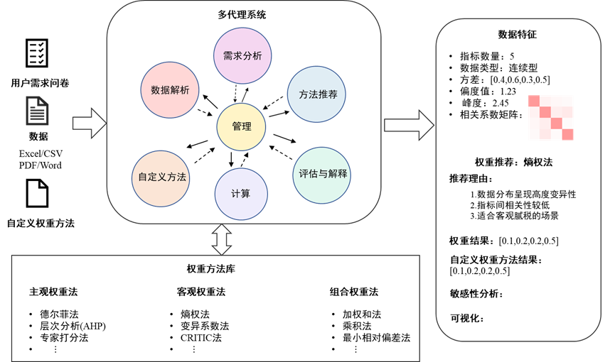
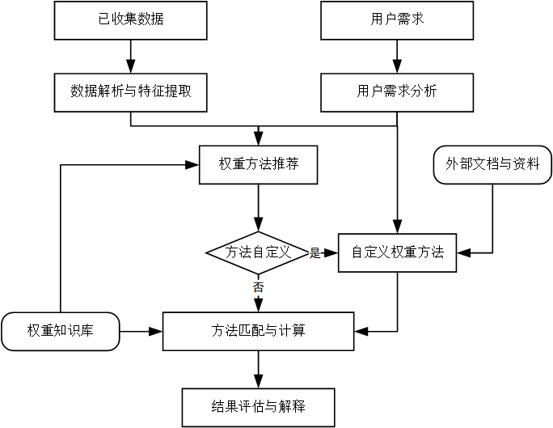
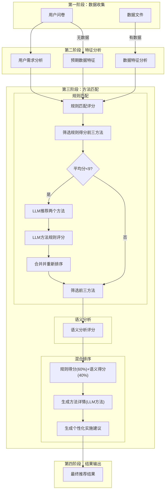

# Zhiheng Weight Determination Platform 🎯

<div align="center">


**智衡权重确定平台**

*Zhiheng Weight Determination Platform*

**大语言模型驱动的权重确定全流程解决方案**

[](https://zh.dmrc.work)
[](https://github.com/Ruanweiqiao/Zhiheng)
[](https://deepseek.com)
[](LICENSE)

**厦门大学数据挖掘研究中心 官方开发**

[🏠 在线体验](https://zh.dmrc.work) • [📖 使用指南](#快速开始) • [🔧 技术文档](#系统架构) • [🤝 贡献指南](#开发文档)

</div>

---

## 📋 项目简介

智衡权重确定平台（Zhiheng Weight Determination Platform）是厦门大学数据挖掘研究中心开发的**革命性AI驱动统计分析工具**，致力于为权重确定问题提供**全流程、智能化、个性化**的解决方案。

系统基于**大语言模型驱动**的多代理协作架构，采用**四维度分析框架**（任务-数据-用户-环境），通过智能问卷收集、数据特征分析、AI方法推荐等技术，为用户提供最适合的权重计算方法和完整的实施方案。

### 🌟 核心价值

- **🚀 全流程覆盖**：从方法推荐到计算实施，再到结果解释的完整闭环
- **🤖 七代理协作**：七大专业代理+管理代理的多代理系统架构
- **🔬 算法创新**：规则+语义分析的双重匹配算法创新
- **🧠 推理增强**：基于语义推理的知识推荐算法
- **🎯 四维度分析**：任务-数据-用户-环境的全面评估体系
- **⚡ 一站式平台**：四大核心模块满足不同层次的权重确定需求
- **🎨 专业易用**：Apple风格设计，支持移动端，专业而直观

### 🎯 适用场景

| 领域                    | 应用场景           | 典型问题                   |
| ----------------------- | ------------------ | -------------------------- |
| **🎓 学术研究**   | 论文写作、课题研究 | 多指标评价体系权重确定     |
| **🏢 企业管理**   | 绩效评估、决策分析 | KPI权重分配、供应商评价    |
| **🏛️ 政策分析** | 公共政策评估       | 社会指标权重、政策效果评价 |
| **🔬 工程评价**   | 项目评估、技术选型 | 工程方案比较、质量评价体系 |

---

## 🏗️ 四大核心模块

智衡平台采用模块化架构设计，提供权重确定问题的完整解决方案：

```
🎯 智衡权重确定平台 - 四大核心模块
│
├── 📊 模块一：权重方法推荐 ✅ 已完成
│   ├── 🤖 AI三代理协作推荐
│   ├── 📋 智能问卷收集需求
│   ├── 🔍 20+种权重方法覆盖
│   ├── 🎯 四维度精准匹配
│   └── 📝 个性化实施建议
│
├── ⚙️ 模块二：权重计算 🔄 内测中
│   ├── 🚀 自动化权重数值计算
│   ├── 📁 批量数据处理
│   ├── 📊 多种数据格式支持
│   ├── ⚡ 高效计算引擎
│   └── 📈 实时计算进度
│
├── 🛠️ 模块三：自定义方法计算 🔄 内测中
│   ├── 🎨 可视化编程界面
│   ├── 🧩 自定义算法构建
│   ├── 🔧 灵活参数配置
│   ├── 🔍 算法验证测试
│   └── 💾 方法保存共享
│
└── 📈 模块四：结果解释与可视化 🔄 内测中
    ├── 🧠 AI智能结果解释
    ├── 📊 多样化图表展示
    ├── 📄 专业报告生成
    ├── 🎭 交互式可视化
    └── 📤 结果导出分享
```

### 模块状态说明

| 模块                       | 状态               | 功能描述             | 预计发布 |
| -------------------------- | ------------------ | -------------------- | -------- |
| **权重方法推荐**     | ✅**已完成** | AI驱动的智能方法推荐 | 已发布   |
| **权重计算**         | 🔄**内测中** | 自动化权重数值计算   | 2025年Q2 |
| **自定义方法计算**   | 🔄**内测中** | 用户自定义算法实现   | 2025年Q3 |
| **结果解释与可视化** | 🔄**内测中** | 智能解释和可视化展示 | 2025年Q4 |

---

## 🤖 系统整体架构

### 多代理系统架构

智衡平台采用多代理协作架构，由七大专业代理和一个管理代理组成：



#### 七大专业代理 + 管理代理

| 代理类型                 | 核心职责                     | 技术特点               |
| ------------------------ | ---------------------------- | ---------------------- |
| **需求分析代理**   | 解析用户问卷，提取需求特征   | 自然语言处理、特征提取 |
| **数据解析代理**   | 分析数据文件，评估数据质量   | 数据挖掘、统计分析     |
| **方法推荐代理**   | 基于特征匹配推荐方法         | 知识图谱、相似度计算   |
| **评估与解释代理** | 评估推荐结果，生成解释       | 可解释AI、评估模型     |
| **计算代理**       | 执行权重计算任务             | 数值计算、算法实现     |
| **自定义方法代理** | 处理用户自定义方法           | 代码解析、动态执行     |
| **管理代理**       | 中心协调，统一调度各代理协作 | 任务调度、资源管理     |

### 系统整体运行流程



基于流程图的完整运行流程：

- **已收集数据** → 数据解析与特征提取
- **用户需求** → 用户需求分析
- **权重方法推荐** → 方法自定义判断 → 自定义权重方法
- **权重知识库** → 方法匹配与计算 → 结果评估与解释

---

## 🚀 核心算法创新

智衡平台在权重方法推荐领域实现了两项重要算法创新：

### 创新算法一：基于规则+语义分析的方案匹配算法

```
🔬 规则+语义融合匹配算法
├── 规则匹配层：基于四维度特征进行精确规则匹配
├── 语义分析层：利用大语言模型进行语义相似度分析  
├── 融合策略：规则得分 + 语义得分加权融合
└── 技术优势：既保证匹配精度，又具备语义理解能力
```

**核心创新点**：

- 传统规则匹配确保基础准确性
- 语义分析增强对复杂需求的理解
- 动态权重融合优化推荐效果

### 创新算法二：基于规则+语义推理的知识推荐算法

```
🧠 规则+语义推理知识推荐算法
├── 知识库检索：基于规则的传统方法快速筛选
├── 语义推理增强：LLM语义推理补充创新方法
├── 混合推荐：传统知识库 + AI创新推荐的双轨并行
└── 自适应触发：当规则匹配不足时自动启用语义推理
```

**创新价值**：

- 扩展了推荐方法的覆盖范围
- 实现了从已知知识到创新方法的突破
- 提供了个性化和前沿性的平衡

---

## 📊 模块一详细介绍：权重方法推荐

### 🎯 核心功能

模块一是智衡平台的核心模块，基于**多代理协作**和**四维度分析**框架，为用户智能推荐最适合的权重计算方法。

### 🤖 AI三代理协作架构（模块架构）

模块一采用三个AI代理协作完成推荐过程：

```
┌─────────────────┐    ┌─────────────────┐    ┌─────────────────┐
│   用户需求分析   │───▶│   数据特征分析   │───▶│   方法推荐代理   │
│     代理        │    │     代理        │    │               │
└─────────────────┘    └─────────────────┘    └─────────────────┘
         │                       │                       │
         ▼                       ▼                       ▼
┌─────────────────┐    ┌─────────────────┐    ┌─────────────────┐
│  四维度需求特征  │    │   数据质量评估   │    │   智能方法推荐   │
│     JSON        │    │      结果       │    │     列表        │
└─────────────────┘    └─────────────────┘    └─────────────────┘
```

#### 三大AI代理职责

| 代理                   | 核心职责                           | 输出结果           |
| ---------------------- | ---------------------------------- | ------------------ |
| **需求分析代理** | 解析用户问卷，提取关键需求特征     | 四维度需求特征JSON |
| **数据分析代理** | 分析上传数据或预期数据特征         | 数据质量评估结果   |
| **方法推荐代理** | 基于规则匹配和语义分析推荐权重方法 | 智能方法推荐列表   |

### 📐 四维度分析框架

系统从四个关键维度对权重方法进行全面评估：

```
🎯 任务维度 (Task Dimension)
├── 评价领域：环境、经济、技术、管理等
├── 评价目的：排序、筛选、评估、预警等  
├── 评价性质：描述性、预测性、决策性、优化性
├── 复杂程度：低、中、高
└── 应用范围：内部管理、外部报告、学术研究

📊 数据维度 (Data Dimension)
├── 指标数量：少量(≤10)、中等(10-30)、大量(≥30)
├── 变量类型：定量、定性、混合
├── 数据质量：完整性、一致性、准确性
├── 数据结构：单层次、多层次、网络结构
└── 缺失情况：无缺失、少量缺失、大量缺失

👤 用户维度 (User Dimension)
├── 精确度需求：高、中、低
├── 方法偏好：主观、客观、混合
├── 知识水平：初级、中级、高级、专家级
├── 风险容忍度：高、中、低
├── 可解释性：高需求、中需求、低需求
└── 特殊需求：快速实施、高可信度等

🌐 环境维度 (Environment Dimension)
├── 专家资源：充足、有限、无
├── 时间约束：紧迫、适中、充裕
├── 计算资源：基础、专业、高级
├── 成本约束：严格、适中、宽松
└── 应用场景：学术研究、商业应用、政策制定
```

### 🔄 智能推荐流程

#### 模块流程图



基于流程图，系统采用三阶段精准推荐策略：

#### 阶段一：数据收集与特征提取

```
📋 用户需求收集
├── 智能问卷：四维度结构化问卷
├── 补充说明：用户自由文本输入
└── 数据上传：CSV/Excel文件（可选）

📊 数据特征提取
├── 有数据：自动解析数据特征
│   ├── 指标识别：自动识别指标类型和数量
│   ├── 质量评估：完整性、异常值检测
│   └── 分布分析：正态性、相关性分析
└── 无数据：基于问卷预测特征
    ├── 预期指标：用户描述的指标情况
    ├── 数据预期：预计的数据质量状况
    └── 特征构建：构建预期数据特征模型
```

#### 阶段二：智能方法匹配

```
🎯 三阶段推荐策略
├── 第一步：规则匹配
│   ├── 基于四维度特征进行规则匹配
│   ├── 筛选规则得分排名前三的方法
│   └── 评估：平均分≥8分则直接推荐，<8分则启用LLM补充
│
├── 第二步：LLM增强（条件触发）
│   ├── 当规则匹配平均分<9分时启用
│   ├── LLM推荐2个创新方法
│   ├── 对LLM方法进行规则评分
│   └── 合并并重新排序选出前三
│
└── 第三步：语义分析
    ├── 对候选方法进行语义相似度分析
    ├── 生成语义匹配评分
    └── 综合评分：规则得分(60%) + 语义得分(40%)
```

#### 阶段三：结果生成与优化

```
📝 个性化结果生成
├── 方法详情生成：为LLM推荐方法生成详细说明
├── 实施建议生成：基于用户特征的个性化指导
├── 风险评估：潜在风险和注意事项
└── 计算示例：具体的计算步骤和案例
```

### 📚 权重方法库

系统内置20+种权重方法，涵盖三大类别：

#### 🧠 主观权重法

| 方法名称                  | 核心原理           | 适用场景           | 复杂度 |
| ------------------------- | ------------------ | ------------------ | ------ |
| **层次分析法(AHP)** | 成对比较，层次分解 | 复杂决策，层次明确 | 高     |
| **德尔菲法**        | 专家共识，多轮调研 | 预测评估，专家充足 | 中     |
| **模糊综合评价法**  | 模糊集理论，隶属度 | 模糊信息，定性评价 | 高     |
| **直接评分法**      | 专家直接赋权       | 简单快速，专家可信 | 低     |

#### 📊 客观权重法

| 方法名称               | 核心原理         | 适用场景           | 数据要求 |
| ---------------------- | ---------------- | ------------------ | -------- |
| **熵权法**       | 信息熵，变异程度 | 数据充足，指标独立 | 高       |
| **变异系数法**   | 离散程度，标准差 | 量化数据，变异明显 | 中       |
| **CRITIC法**     | 相关性，冲突性   | 指标关联，对比度   | 高       |
| **主成分分析法** | 降维，主成分贡献 | 多指标，降维需求   | 高       |

#### 🔄 组合权重法

| 方法名称             | 核心原理             | 适用场景   | 平衡特点 |
| -------------------- | -------------------- | ---------- | -------- |
| **乘法综合法** | 几何平均，非线性组合 | 主客观平衡 | 几何平均 |
| **加法综合法** | 线性组合，权重叠加   | 简单有效   | 算术平均 |
| **博弈组合法** | 博弈论，最优化       | 冲突协调   | 纳什均衡 |

---

## 🔧 系统架构

### 💻 技术栈

#### 前端架构

```
📱 现代前端技术
├── HTML5 + CSS3 + ES6+        # 现代Web标准
├── ES Modules                 # 模块化架构  
├── MathJax 3.0               # 数学公式渲染
├── Apple Design System        # 设计语言
└── Responsive Layout          # 响应式布局
```

#### 后端集成

```
🔗 AI服务集成
├── DeepSeek API              # 大语言模型服务
│   ├── Model: deepseek-chat
│   ├── Temperature: 0.3
│   └── Max Tokens: 4000
└── 部署平台
    ├── 主站：zh.dmrc.work
    ├── GitHub Pages
    └── 本地部署
```

### 🏛️ 架构设计

#### 模块化架构

```javascript
// 系统模块依赖关系
app.js (主控制器)
├── import LLMService from './llmService.js'     # AI服务
│   ├── import prompts from './agent-prompts.js'  # 代理提示词
│   └── import config from './config.js'          # 配置管理
├── import weightMethods from './weightMethods.js' # 方法库
└── 页面模块
    ├── home.html                                 # 首页
    ├── index.html                               # 主应用
    └── about.html                               # 关于页面
```

#### 数据流架构

```
🔄 数据处理流程
├── 用户输入 → 问卷数据收集
├── 文件上传 → 数据特征提取  
├── AI分析 → 四维度特征分析
├── 方法匹配 → 智能推荐算法
├── 结果生成 → 个性化输出
└── 用户反馈 → 持续优化
```

---

## 🚀 快速开始

### 🌐 在线体验

**最简单的方式：直接访问在线平台**

👉 [https://zh.dmrc.work](https://zh.dmrc.work)

- 无需安装，即开即用
- 支持所有现代浏览器
- 完整功能体验
- 移动端友好

### 💻 本地部署

#### 前置要求

```bash
# 系统要求
✅ 现代浏览器（Chrome, Firefox, Edge等最新版本）
✅ 网络连接（用于LLM API调用）
✅ HTTP服务器（解决CORS问题）
✅ DeepSeek API密钥（用于AI功能）
```

#### 安装步骤

1. **克隆仓库**

   ```bash
   git clone https://github.com/Ruanweiqiao/Zhiheng.git
   cd Zhiheng
   ```
2. **配置API密钥**

   #### 🔑 支持的LLM服务商

   智衡平台支持三种大语言模型服务：

   | 服务商 | 模型 | 获取方式 | 推荐指数 |
   |--------|------|----------|----------|
   | **🧠 DeepSeek** | deepseek-chat | [platform.deepseek.com](https://platform.deepseek.com/) | ⭐⭐⭐⭐⭐ |
   | **🤖 OpenAI** | gpt-3.5-turbo | [platform.openai.com](https://platform.openai.com/) | ⭐⭐⭐⭐ |
   | **🔮 通义千问** | qwen-turbo | [dashscope.aliyun.com](https://dashscope.aliyun.com/) | ⭐⭐⭐⭐ |

   #### 🚀 Vercel部署配置（推荐）

   如果您要部署到Vercel，请在Vercel Dashboard中配置环境变量：

   **必需配置（至少配置一组）：**
   ```bash
   # DeepSeek API密钥（推荐）
   DEEPSEEK_API_KEY=sk-your-deepseek-key
   DEEPSEEK_API_KEY_2=sk-your-backup-key-1  # 可选，提升性能
   DEEPSEEK_API_KEY_3=sk-your-backup-key-2  # 可选，提升性能
   ```

   **可选配置：**
   ```bash
   # OpenAI API密钥
   OPENAI_API_KEY=sk-your-openai-key
   OPENAI_API_KEY_2=sk-your-openai-backup-1
   OPENAI_API_KEY_3=sk-your-openai-backup-2

   # 通义千问 API密钥
   QWEN_API_KEY=your-qwen-key
   QWEN_API_KEY_2=your-qwen-backup-1
   QWEN_API_KEY_3=your-qwen-backup-2
   ```

   #### 🖥️ 本地开发配置

   创建或编辑 `config.js` 文件：

   ```javascript
   export const API_CONFIG = {
     USE_LLM: true,
     MULTI_API_ENABLED: true,
     
     // 支持的模型配置
     SUPPORTED_MODELS: [
       {
         id: 'deepseek',
         name: 'Deepseek',
         apiUrl: 'https://api.deepseek.com/v1/chat/completions',
         model: 'deepseek-chat',
         temperature: 0.3,
         max_tokens: 4000
       },
       {
         id: 'openai',
         name: 'ChatGPT',
         apiUrl: 'https://api.openai.com/v1/chat/completions',
         model: 'gpt-3.5-turbo',
         temperature: 0.7,
         max_tokens: 4000
       },
       {
         id: 'qwen',
         name: '通义千问',
         apiUrl: 'https://dashscope.aliyuncs.com/compatible-mode/v1/chat/completions',
         model: 'qwen-turbo',
         temperature: 0.5,
         max_tokens: 4000
       }
     ],
     
     // 本地开发API密钥配置
     USE_LOCAL_API_KEYS: true,  // 本地开发时设置为true
     LOCAL_API_KEYS: {
       DEEPSEEK_API_KEY: "your-deepseek-api-key",
       DEEPSEEK_API_KEY_2: "", // 可选
       DEEPSEEK_API_KEY_3: "", // 可选
       OPENAI_API_KEY: "",     // 可选
       QWEN_API_KEY: ""        // 可选
     }
   };
   ```

   #### 🔧 用户界面配置

   用户也可以在前端界面配置API密钥：

   1. 访问平台主页
   2. 点击"🔑 API密钥设置"按钮
   3. 选择喜欢的AI模型
   4. 输入API密钥并保存
   5. 享受个性化AI服务
3. **启动本地服务器**

   ```bash
   # 方式一：使用Python
   python -m http.server 8000

   # 方式二：使用Node.js
   npx serve .

   # 方式三：使用Live Server扩展（VS Code推荐）
   # 安装Live Server扩展后，右键HTML文件选择"Open with Live Server"
   ```
4. **访问应用**

   ```
   http://localhost:8000/home.html  # 平台首页
   http://localhost:8000/index.html # 权重方法推荐主应用
   http://localhost:8000/about.html # 关于页面
   ```

### 🔧 高级配置

#### API配置选项

```javascript
// config.js - 高级配置
export const API_CONFIG = {
  // 基础设置
  USE_LLM: true,                    // 是否启用LLM功能
  MULTI_API_ENABLED: true,          // 是否启用多API配置
  
  // API配置数组
  API_CONFIGS: [
    {
      id: 'primary',
      key: "your-primary-api-key",
      url: "https://api.deepseek.com/v1/chat/completions",
      model: "deepseek-chat",
      temperature: 0.3,
      max_tokens: 4000,
      timeout: 30000
    },
    {
      id: 'backup',
      key: "your-backup-api-key", 
      url: "https://api.backup.com/v1/chat/completions",
      model: "backup-model",
      temperature: 0.3,
      max_tokens: 4000,
      timeout: 30000
    }
  ],

  // 功能开关
  FEATURES: {
    DATA_UPLOAD: true,              // 数据上传功能
    SEMANTIC_ANALYSIS: true,        // 语义分析
    LLM_SUPPLEMENT: true,           // LLM补充推荐
    PERSONALIZED_ADVICE: true      // 个性化建议
  }
};
```

---

## 📝 使用指南

### 🎯 完整使用流程

#### 第1步：访问平台

- 访问 [zh.dmrc.work](https://zh.dmrc.work)
- 选择"权重方法推荐"模块
- 点击"立即使用"开始体验

#### 第2步：填写智能问卷

智能问卷采用四维度结构化设计，引导用户提供关键信息：

##### 🎯 任务特征（25%进度）

```
📋 核心任务特征
├── 评价领域：
│   └── 选择：环境评价、经济分析、技术评估、管理决策等
├── 评价目的：
│   └── 选择：排序筛选、综合评估、预警监测、优化决策等
├── 问题复杂度：
│   └── 评估：低(简单指标)、中(中等复杂)、高(复杂系统)
└── 应用范围：
    └── 选择：内部管理、外部报告、学术研究、政策制定等
```

##### 📊 数据条件（50%进度）

```
📊 数据条件评估
├── 数据来源：
│   └── 选择：原始数据、专家评分、问卷调查、文献资料等
├── 指标数量：
│   └── 估算：少量(≤10个)、中等(10-30个)、大量(≥30个)
├── 数据质量：
│   └── 评估：完整性、准确性、一致性、时效性
├── 文件上传：（可选）
│   └── 支持：CSV、Excel、TXT等格式
└── 数据预览：
    └── 实时预览上传的数据内容
```

##### 🌐 实施环境（75%进度）

```
🌐 实施环境评估
├── 时间约束：
│   └── 选择：紧迫(≤1周)、适中(1-4周)、充裕(≥1月)
├── 专家资源：
│   └── 评估：充足(多位专家)、有限(1-2位)、无专家资源
├── 计算资源：
│   └── 选择：基础(Excel)、专业(SPSS/R)、高级(编程)
└── 成本约束：
    └── 考虑：时间成本、人力成本、软件成本等
```

##### 👤 用户偏好（100%进度）

```
👤 用户偏好设置
├── 方法偏好：
│   └── 选择：主观(专家经验)、客观(数据驱动)、混合(平衡)
├── 知识水平：
│   └── 自评：初级、中级、高级、专家级
├── 精确度要求：
│   └── 设定：高精度、中等精度、快速估算
├── 特殊需求：
│   └── 勾选：高可解释性、易于实施、结果稳定等
└── 补充说明：
    └── 自由文本：详细描述特殊需求和背景
```

#### 第3步：数据上传与分析（可选）

##### 智能数据上传

```
📁 支持的数据格式
├── CSV文件：标准逗号分隔值
├── Excel文件：.xlsx, .xls格式
├── TXT文件：制表符分隔
└── 数据要求：
    ├── 第一行为指标名称
    ├── 每行为一个评价对象
    └── 数值型数据优先
```

##### 自动数据分析

```
🔍 智能数据分析功能
├── 指标识别：
│   ├── 自动识别数值型/分类型指标
│   ├── 统计指标数量和分布
│   └── 检测指标间相关性
├── 质量评估：
│   ├── 缺失值检测和统计
│   ├── 异常值识别和标记
│   └── 数据一致性检查
├── 统计摘要：
│   ├── 描述性统计信息
│   ├── 分布特征分析
│   └── 数据质量报告
└── 可视化预览：
    ├── 数据表格展示
    ├── 分布直方图
    └── 相关性热力图
```

#### 第4步：查看AI推荐结果

##### 推荐结果展示

```
🎯 智能推荐结果
├── 推荐方法卡片：
│   ├── 方法名称和类别
│   ├── 推荐理由和优势
│   ├── 适用性评分
│   └── 实施难度评估
├── 四维度匹配分析：
│   ├── 任务维度匹配度
│   ├── 数据维度匹配度  
│   ├── 用户维度匹配度
│   └── 环境维度匹配度
├── 方法来源标识：  
│   ├── 🔵 数据库方法（传统经典）
│   ├── 🟣 AI推荐方法（创新前沿）
│   └── 🟢 混合方法（组合优化）
└── 详细信息：
    ├── 📊 数学模型和公式
    ├── 📝 计算步骤详解
    ├── ⚠️ 注意事项和限制
    └── 📚 参考文献和资料
```

##### 个性化实施建议

```
📋 个性化实施指导
├── 实施策略：
│   ├── 推荐的具体实施方案
│   ├── 分阶段实施计划
│   └── 关键里程碑设定
├── 资源配置：
│   ├── 所需专家类型和数量
│   ├── 计算工具和软件推荐
│   └── 预估时间和成本
├── 风险控制：
│   ├── 潜在风险点识别
│   ├── 预防措施建议
│   └── 应急预案制定
└── 质量保证：
    ├── 结果验证方法
    ├── 可信度评估标准
    └── 持续改进建议
```

---

## 🔧 开发文档

### 📁 项目文件结构

```
📁 Zhiheng/
├── 📄 home.html              # 平台首页 - 模块导航和项目介绍
├── 📄 index.html             # 主应用 - 权重方法推荐核心功能
├── 📄 about.html             # 关于页面 - 研究中心和团队介绍
├── 📄 README.md              # 原版项目文档
├── 📄 README1.md             # 新版详细文档（本文件）
│
├── 🎨 样式文件/
│   ├── home-style.css        # 首页样式 - Apple风格设计
│   ├── style.css             # 主应用样式 - 响应式布局
│   └── about-style.css       # 关于页面样式
│
├── 🚀 核心功能/
│   ├── app.js                # 主控制器 - UI交互和状态管理
│   ├── llmService.js         # AI服务 - LLM调用和推荐引擎
│   ├── weightMethods.js      # 方法库 - 20+种权重方法详细信息
│   ├── agent-prompts.js      # 提示词库 - 六大代理的LLM模板
│   └── config.js             # 配置管理 - API密钥和功能开关
│
├── 📊 静态资源/
│   ├── 微信图片_20230714090909.jpg  # 项目Logo
│   ├── 系统架构.png                 # 系统架构图
│   └── 流程.jpg                     # 业务流程图
│
└── 🔧 配置文件/
    ├── vercel.json           # Vercel部署配置
    ├── .gitignore           # Git忽略文件
    └── LICENSE              # MIT许可证
```

### 🏗️ 核心模块设计

#### 1. 状态管理 (app.js)

```javascript
// 全局状态管理
const state = {
  // 用户数据
  userQuestionnaireData: {},        // 问卷收集的四维度数据
  uploadedFiles: [],                // 用户上传的数据文件
  
  // 分析结果  
  userNeedsAnalysis: {},            // 用户需求分析结果
  dataAnalysisResults: {},          // 数据特征分析结果
  
  // 推荐结果
  recommendationResults: [],        // 基础推荐结果
  hybridRecommendationResults: {},  // 混合推荐最终结果
  
  // UI状态
  currentSection: 1,                // 当前问卷步骤
  isLoading: false,                 // 加载状态
  errorMessage: null                // 错误信息
};
```

#### 2. AI服务层 (llmService.js)

```javascript
// 核心推荐引擎
class LLMService {
  // 三阶段推荐主流程
  async performHybridRecommendation(userNeeds, dataFeatures) {
    // 阶段1：规则匹配
    const ruleCandidates = await this.performRuleMatching(userNeeds, dataFeatures);
  
    // 阶段2：LLM增强（条件触发）
    let finalCandidates = ruleCandidates;
    if (this.needsLLMSupplement(ruleCandidates)) {
      const llmMethods = await this.performLLMSupplement(userNeeds, dataFeatures);
      finalCandidates = this.mergeCandidates(ruleCandidates, llmMethods);
    }
  
    // 阶段3：语义分析和综合评分
    const semanticScores = await this.performSemanticAnalysis(finalCandidates);
    return this.calculateFinalScores(finalCandidates, semanticScores);
  }
}
```

#### 3. 方法知识库 (weightMethods.js)

```javascript
// 权重方法数据结构
const weightMethodsDB = [
  {
    name: "层次分析法(AHP)",
    type: "主观赋权法", 
    detail: "方法详细描述...",
    suitConditions: ["适用条件1", "适用条件2"],
    advantages: ["优势1", "优势2"],
    limitations: ["局限性1", "局限性2"],
    implementationSteps: ["步骤1", "步骤2"],
  
    // 四维度属性定义
    dimensionalAttributes: {
      taskDimension: { domain: [...], purpose: [...] },
      dataDimension: { indicatorCount: [...], variableType: [...] },
      userDimension: { precision: [...], methodPreference: [...] },
      environmentDimension: { expertiseLevel: [...], timeConstraint: [...] }
    },
  
    // 数学模型（LaTeX格式）
    mathematicalModel: "$$W_i = \\frac{1-E_i}{n-\\sum_{i=1}^{n}E_i}$$"
  }
];
```

### 🔧 开发指南

#### 环境设置

```bash
# 1. 克隆项目
git clone https://github.com/Ruanweiqiao/Zhiheng.git

# 2. 安装开发工具（推荐）
# VS Code + Live Server扩展
# 或者使用其他HTTP服务器

# 3. 配置API密钥
# 编辑config.js文件，设置DeepSeek API密钥

# 4. 启动开发服务器
python -m http.server 8000
# 或 npx serve .
```

#### 代码规范

```javascript
// 1. ES6+ 模块化
import { LLMService } from './llmService.js';

// 2. 异步处理
async function handleRecommendation() {
  try {
    const result = await llmService.performHybridRecommendation();
    return result;
  } catch (error) {
    console.error('推荐失败:', error);
    throw error;
  }
}

// 3. 错误处理
function showErrorMessage(message) {
  console.error('错误:', message);
  // 显示用户友好的错误信息
}
```

#### 扩展开发

```javascript
// 1. 添加新的权重方法
const newMethod = {
  name: "新权重方法",
  type: "客观赋权法",
  // ... 完整的方法定义
};
weightMethodsDB.push(newMethod);

// 2. 自定义代理提示词
const customPrompt = `
你是一个权重方法专家...
### 任务要求: ${customRequirement}
### 输出格式: ${outputFormat}
`;

// 3. 集成新的AI服务
class CustomLLMService extends LLMService {
  async callCustomAPI(prompt) {
    // 自定义API调用逻辑
  }
}
```

---

## 🎓 学术背景

### 🏛️ 厦门大学数据挖掘研究中心

#### 中心概况

**厦门大学数据挖掘研究中心**成立于2006年，是校直属的跨学科教学科研机构。中心充分发挥学科交叉优势，整合统计学、计量经济学、数量经济学、信息管理学等相关学科，致力于数据科学理论创新与实践应用。

#### 发展历程

- **2006年**：研究中心正式成立
- **2010年**：升级为校直属教学科研机构
- **2015年**：获批数据科学与大数据技术专业
- **2020年**：启动AI赋能统计学研究计划
- **2025年**：发布智衡权重确定平台

#### 学术实力

```
📊 研究中心学术指标
├── 👥 师资力量：50+ 专业研究人员
├── 📝 学术成果：150+ 高水平论文发表
├── 🏆 科研项目：100+ 国家级省部级项目
├── 🎓 人才培养：1000+ 本硕博毕业生
└── 🌐 国际合作：30+ 海外高校合作
```

### 📚 理论基础

#### 权重确定理论体系

智衡平台基于现代权重确定理论体系，整合了以下核心理论：

```
🔬 理论基础体系
├── 📊 多准则决策理论 (MCDM)
│   ├── 层次分析理论 (AHP Theory)
│   ├── 模糊集理论 (Fuzzy Set Theory)  
│   └── 博弈论 (Game Theory)
│
├── 📈 信息理论与统计学
│   ├── 信息熵理论 (Information Entropy)
│   ├── 主成分分析 (PCA Theory)
│   └── 贝叶斯统计 (Bayesian Statistics)
│
├── 🤖 人工智能理论
│   ├── 机器学习理论 (ML Theory)
│   ├── 深度学习理论 (DL Theory)
│   └── 多代理系统 (Multi-Agent Systems)
│
└── 🎯 决策科学理论
    ├── 决策支持系统 (DSS Theory)
    ├── 专家系统理论 (Expert Systems)
    └── 知识管理理论 (Knowledge Management)
```

#### 创新贡献

##### 1. 四维度分析框架创新

```
📐 四维度分析框架的理论贡献
├── 理论突破：
│   ├── 首次提出任务-数据-用户-环境四维评估模型
│   ├── 建立了权重方法适用性的量化评估体系
│   └── 实现了从定性判断到定量评估的转变
│
├── 方法论创新：
│   ├── 多维度综合评估算法
│   ├── 基于特征匹配的推荐机制
│   └── 个性化实施策略生成方法
│
└── 实践价值：
    ├── 提高权重方法选择的科学性
    ├── 降低非专业用户的使用门槛
    └── 减少方法选择的主观性和随意性
```

##### 2. AI驱动的多代理协作创新

```
🤖 多代理协作系统的创新点
├── 技术创新：
│   ├── 基于LLM的智能代理设计
│   ├── 多代理协作的权重推荐算法
│   └── 自适应的推荐策略调整机制
│
├── 算法创新：
│   ├── 规则匹配与语义分析的融合算法
│   ├── 动态权重的混合推荐策略
│   └── 基于用户反馈的持续学习机制
│
└── 应用创新：
    ├── 实现了权重方法推荐的智能化
    ├── 提供了个性化的实施指导方案
    └── 支持了复杂场景的权重确定需求
```

### 📄 学术价值

#### 理论意义

1. **丰富了多准则决策理论**：提出了四维度权重方法适用性评估框架
2. **推进了AI与统计学的融合**：探索了大语言模型在统计方法推荐中的应用
3. **完善了权重确定方法论**：建立了从方法选择到实施指导的完整体系

#### 实践意义

1. **降低了专业门槛**：让非专业用户也能科学选择权重方法
2. **提高了决策质量**：基于科学评估的方法推荐提升决策准确性
3. **促进了方法应用**：个性化指导帮助用户更好地实施权重方法

#### 社会价值

1. **推动数字化转型**：为政府、企业的数字化决策提供工具支持
2. **促进教育公平**：让更多学生和研究者接触到先进的统计方法
3. **服务国家建设**：为国家重大决策的科学化提供技术支撑

---

## 🤝 贡献指南

### 💡 如何贡献

我们欢迎各种形式的贡献，包括但不限于：

#### 🐛 问题报告

```
📋 问题报告模板
├── 问题描述：详细描述遇到的问题
├── 复现步骤：提供问题的复现步骤
├── 预期结果：说明期望的正确结果
├── 实际结果：描述实际发生的情况
├── 环境信息：浏览器版本、操作系统等
└── 截图附件：相关的错误截图
```

#### 💻 代码贡献

```
🔧 代码贡献流程
├── 1. Fork项目到您的GitHub账号
├── 2. 创建特性分支 (git checkout -b feature/AmazingFeature)
├── 3. 提交您的改动 (git commit -m 'Add some AmazingFeature')
├── 4. 推送到分支 (git push origin feature/AmazingFeature)  
└── 5. 创建Pull Request
```

#### 📚 文档改进

- 改进README文档
- 添加代码注释
- 完善用户指南
- 翻译多语言版本

#### 🧪 方法扩展

- 添加新的权重方法
- 改进现有方法的描述
- 提供更多的应用案例
- 优化算法实现

### 📋 开发规范

#### 代码风格

```javascript
// 1. 使用ES6+语法
const getRecommendation = async (userData) => {
  try {
    return await llmService.recommend(userData);
  } catch (error) {
    console.error('推荐失败:', error);
    throw error;
  }
};

// 2. 清晰的变量命名
const userQuestionnaireData = {};  // ✅ 好的命名
const data = {};                   // ❌ 模糊的命名

// 3. 完善的错误处理
async function processData(data) {
  if (!data) {
    throw new Error('数据不能为空');
  }
  // 处理逻辑...
}
```

#### 提交信息格式

```bash
# 格式：<类型>: <描述>
git commit -m "feat: 添加新的权重方法支持"
git commit -m "fix: 修复数据上传的bug"
git commit -m "docs: 更新README文档"
git commit -m "style: 优化UI界面布局"
```

### 🎯 贡献重点领域

1. **方法库扩展**：添加更多权重计算方法
2. **算法优化**：改进推荐算法的准确性和效率
3. **用户体验**：优化界面设计和交互流程
4. **性能优化**：提升系统响应速度和稳定性
5. **国际化**：支持多语言和本地化

---

## 📞 联系我们

### 👥 项目团队

#### 🏛️ 主办单位

**厦门大学数据挖掘研究中心**

- 🌐 官方网站：[www.dmrc.work](http://www.dmrc.work)
- 📍 地址：福建省厦门市思明区厦门大学思明校区
- 📧 邮箱：

#### 👨‍💻 项目负责人

**阮伟乔**

- 📧 邮箱：ruanweiqiao@stu.xmu.edu.cn
- 🐙 GitHub：[@Ruanweiqiao](https://github.com/Ruanweiqiao)
- 🔗 项目仓库：[Zhiheng](https://github.com/Ruanweiqiao/Zhiheng)

### 📬 联系方式

#### 🐛 问题反馈

如果您在使用过程中遇到问题，请通过以下方式联系我们：

1. **GitHub Issues**：[创建新Issue](https://github.com/Ruanweiqiao/Zhiheng/issues)
2. **邮箱反馈**：ruanweiqiao@stu.xmu.edu.cn
3. **在线平台**：通过 [zh.dmrc.work](https://zh.dmrc.work) 的反馈功能

#### 💡 建议与合作

对于功能建议、学术合作、商业应用等，欢迎联系：

- **学术合作**：contact@dmrc.work
- **技术支持**：ruanweiqiao@stu.xmu.edu.cn
- **商业合作**：请通过官方网站联系表单提交

#### 🌐 关注我们

- **项目官网**：[zh.dmrc.work](https://zh.dmrc.work)
- **研究中心**：[www.dmrc.work](http://www.dmrc.work)
- **GitHub组织**：关注我们的开源项目

### ❓ 常见问题

#### Q1：如何获取不同LLM服务的API密钥？

A1：
- **DeepSeek**：访问 [platform.deepseek.com](https://platform.deepseek.com/) 注册并获取API密钥
- **OpenAI**：访问 [platform.openai.com](https://platform.openai.com/) 注册并获取API密钥  
- **通义千问**：访问 [dashscope.aliyun.com](https://dashscope.aliyun.com/) 注册并获取DashScope API密钥

#### Q2：遇到405 Method Not Allowed错误怎么办？

A2：这是本地开发常见问题，解决方案：
- **Vercel部署**：确保已正确部署到Vercel并配置环境变量
- **本地开发**：使用 `vercel dev` 或配置本地API密钥到 `config.js`
- **API代理**：确认 `/api/llm.js` 文件存在且格式正确

#### Q3：如何配置多个API密钥提升性能？

A3：系统支持每种模型配置3个API密钥：
- **环境变量**：`DEEPSEEK_API_KEY`, `DEEPSEEK_API_KEY_2`, `DEEPSEEK_API_KEY_3`
- **并行调用**：系统会自动使用Promise.race获取最快响应
- **负载均衡**：多个密钥会轮流使用，提升整体性能

#### Q4：本地部署需要什么环境？

A4：只需要现代浏览器和HTTP服务器，推荐使用Python或Node.js启动本地服务。

#### Q5：如何添加新的权重方法？

A5：请参考 `weightMethods.js` 中的数据结构，按照格式添加新方法并提交PR。

#### Q6：支持商业使用吗？

A6：项目采用MIT许可证，支持商业使用，但请保留版权声明。

#### Q7：API调用失败怎么排查？

A7：检查步骤：
1. 确认API密钥格式正确（DeepSeek/OpenAI以`sk-`开头）
2. 检查网络连接和API服务状态
3. 查看浏览器控制台的详细错误信息
4. 确认API配额没有用完

---

## 📄 许可证

本项目采用 [MIT许可证](LICENSE)。

```
MIT License

Copyright (c) 2025 厦门大学数据挖掘研究中心

Permission is hereby granted, free of charge, to any person obtaining a copy
of this software and associated documentation files (the "Software"), to deal
in the Software without restriction, including without limitation the rights
to use, copy, modify, merge, publish, distribute, sublicense, and/or sell
copies of the Software, and to permit persons to whom the Software is
furnished to do so, subject to the following conditions:

The above copyright notice and this permission notice shall be included in all
copies or substantial portions of the Software.

THE SOFTWARE IS PROVIDED "AS IS", WITHOUT WARRANTY OF ANY KIND, EXPRESS OR
IMPLIED, INCLUDING BUT NOT LIMITED TO THE WARRANTIES OF MERCHANTABILITY,
FITNESS FOR A PARTICULAR PURPOSE AND NONINFRINGEMENT. IN NO EVENT SHALL THE
AUTHORS OR COPYRIGHT HOLDERS BE LIABLE FOR ANY CLAIM, DAMAGES OR OTHER
LIABILITY, WHETHER IN AN ACTION OF CONTRACT, TORT OR OTHERWISE, ARISING FROM,
OUT OF OR IN CONNECTION WITH THE SOFTWARE OR THE USE OR OTHER DEALINGS IN THE
SOFTWARE.
```

---

## 🔮 未来规划

### 🗓️ 开发路线图

#### 2025年Q2 - 模块二：权重计算

```
⚙️ 权重计算模块
├── 📊 自动化计算引擎
├── 📁 批量数据处理
├── 📈 实时计算进度
├── 🔍 结果验证功能
└── 📤 多格式结果导出
```

#### 2025年Q3 - 模块三：自定义方法计算

```
🛠️ 自定义方法模块
├── 🎨 可视化算法编辑器
├── 🧩 拖拽式算法构建
├── 🔧 参数配置界面
├── 🧪 算法测试验证
└── 💾 方法保存与分享
```

#### 2025年Q4 - 模块四：结果解释与可视化

```
📈 结果解释模块
├── 🧠 AI智能结果解释
├── 📊 多样化图表展示
├── 📄 专业报告生成
├── 🎭 交互式可视化
└── 🌐 在线分享功能
```

### 🚀 长期愿景

- **🌍 国际化**：支持多语言，服务全球用户
- **🎓 教育版**：为高校提供专业的教学版本
- **🏢 企业版**：为企业提供定制化解决方案
- **📱 移动应用**：开发专门的移动端应用
- **🔗 生态系统**：构建权重确定领域的完整生态

---

<div align="center">

## ⭐ 如果这个项目对您有帮助，请给我们一个Star！

### 🎯 智衡权重确定平台

**让权重确定更智能、更科学、更简单**

**Zhiheng Weight Determination Platform**
*Making Weight Determination Smarter, More Scientific, and Simpler*

---

**📧 联系我们** • **🌐 在线体验** • **📚 学术合作** • **💻 开源贡献**

[zh.dmrc.work](https://zh.dmrc.work) | [GitHub](https://github.com/Ruanweiqiao/Zhiheng) | [厦门大学数据挖掘研究中心](http://www.dmrc.work)

---

*© 2025 厦门大学数据挖掘研究中心. All rights reserved.*

</div>
